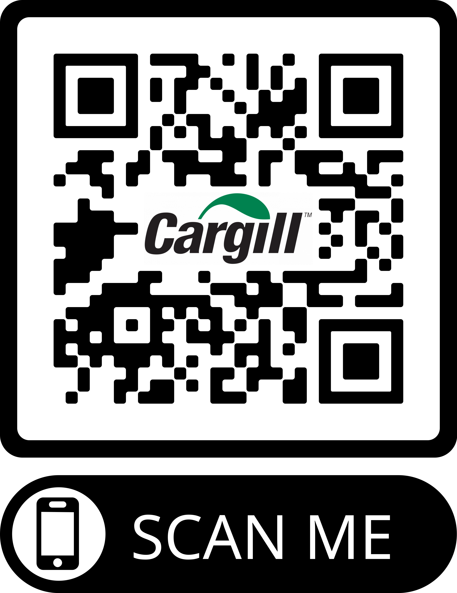
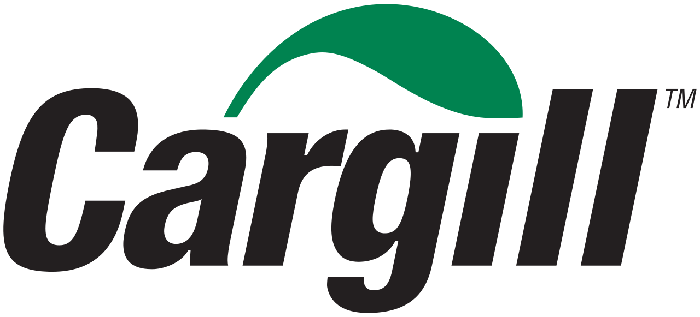
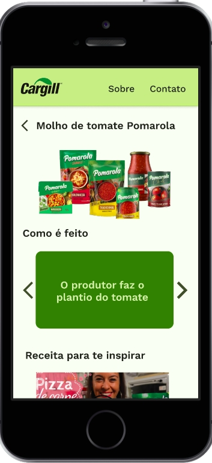
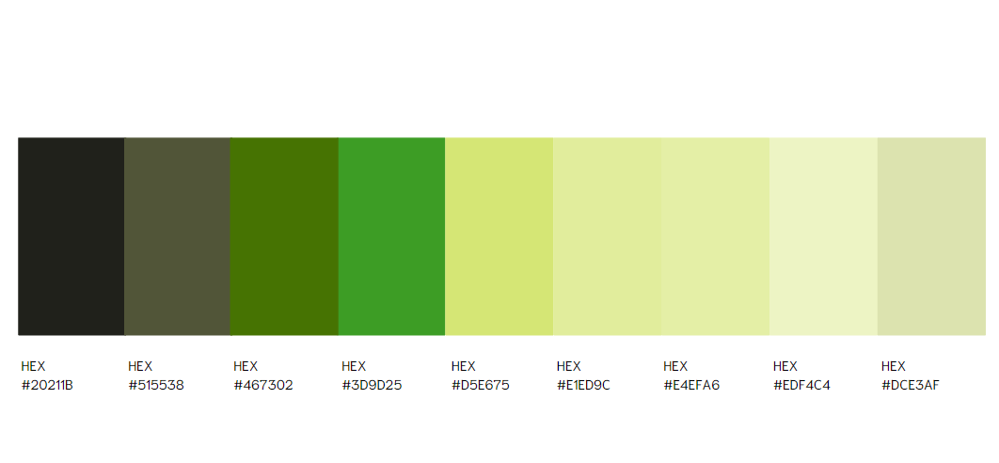
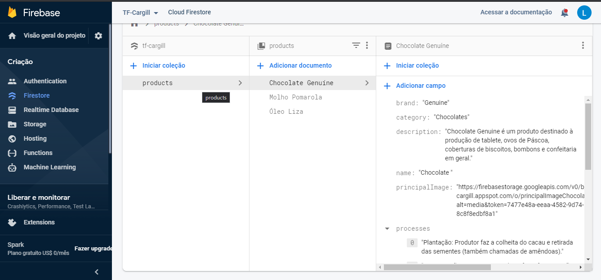
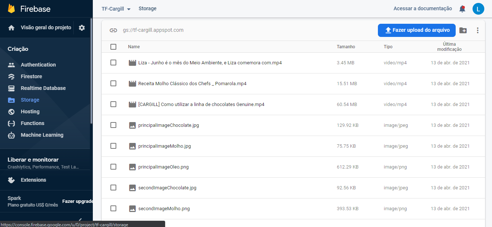
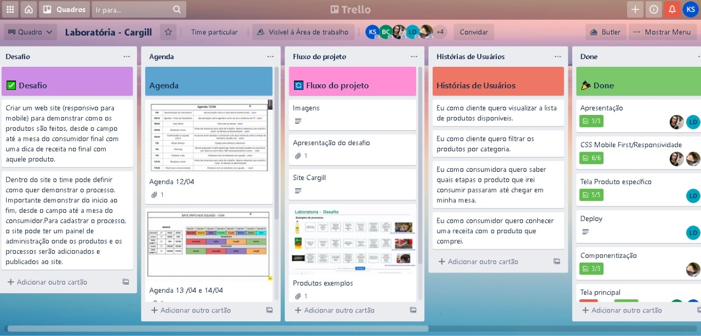

# Talent Fest - Cargill

 Acesse a aplicação <a href="https://tf-cargill.web.app/">aqui</a> ou 

  

## Índice

- [Apresentação](#apresentação)
- [Cargill](#cargill)
- [Talent Fest](#talent-fest)
- [Histórias de Usuários](#histórias-de-usuários)
- [Protótipos](#protótipos)
- [Testes](#testes)
- [Design](#design)
  - [Cores](#cores)
  - [Interface](#interface)
  - [Responsividade](#responsividade)
- [Painel de Administração](#painel-de-administração)
- [Planejamento](#planejamento)
- [Tecnologias Utilizadas](#tecnologias-utilizadas)
- [Futuras Implementações](#futuras-implementações)
- [Desenvolvedoras](#desenvolvedoras)

---

## Apresentação

Você já se perguntou como os produtos do mercado são feitos até chegarem no seu carrinho ? Pois então encontrou a resposta !
Com objetivo de disponibilizar informações e aumentar transparência da empresa, a [Cargill](https://www.cargill.com.br) nos desafiou a desenvolver uma aplicação web que demonstre como seus produtos alimentícios são feitos, desde o campo até a mesa do cliente final. Projeto realizado sob demanda da empresa, foi desenvolvido no evento Talent Fest promovido pela [<Laboratória>](https://www.laboratoria.la/br).

## Cargill

A Cargill oferece serviços e produtos alimentícios, agrícolas, financeiros e industriais ao mundo. Juntamente com produtores rurais, clientes, governos e comunidades, ajuda as pessoas a prosperar com a aplicação de suas ideias há mais de 155 anos. Tem 155.000 funcionários em 70 países, que estão comprometidos a fornecer alimentos ao mundo de uma forma responsável, reduzindo o impacto ambiental e melhorando as comunidades onde atuam.

  

## Talent Fest

O [Talent Fest](https://talentfest.laboratoria.la/br) é um hackathon organizado pela Laboratória ao final de cada bootcamp para conectar as alunas ao mercado de tecnologia. É o espaço perfeito para que as empresas conheçam o potencial do talento feminino da Laboratória, pois as estudantes trabalham com cases reais propostos pelas organizações participantes. A quinta edição do evento ocorreu entre os dias 12 e 15 de abril de 2021 de maneira remota e foi exibido em tempo real no [Youtube](https://www.youtube.com/watch?v=I4quRx-Nrs4).

## Histórias De Usuários

O aplicativo foi realizado baseado nas seguintes histórias de usuários:

- Eu como cliente quero visualizar a lista de produtos disponíveis.

- Eu como cliente quero filtrar os produtos por categoria.

- Eu como consumidora quero saber quais etapas o produto que irei consumir passaram até chegar em minha mesa.

- Eu como cozinheiro quero conhecer uma receita com o produto que comprei.

## Protótipos

Os protótipos foram criados através da ferramenta Figma, utilizando o conceito de mobile first.

  

  

## Testes

Ao longo do processo de prototipagem, realizamos testes e recebemos os seguintes feedbacks e as respectivas resoluções que realizamos:

:heavy_exclamation_mark: Nomes das categorias de filtragem técnicos e não populares, dificultando entendimento  
:heavy_check_mark: Definir nomes das categorias com sonônimos não técnicos e populares.

:heavy_exclamation_mark: Vídeo sugestão de receita ao final das etapas no carrocel, dificulta a visualização para usuário frequente 
:heavy_check_mark: Definir localização do vídeo fora do carrocel, abaixo das etapas de processamento, na tela principal do produto.

## Design

A identidade Visual da aplicação seguiu conceitos de User Experience, testes de usabilidade, testes de produto e code review in par.

### Cores 

A paleta de cores escolhida seguiu a identidade da empresa.

  

### Interface

A interface finalizou desta forma:

  

### Responsividade

A responsividade para mobile finalizou desta forma:

  

## Painel de administração

Utilizamos o Firebase como banco de dados e como painel de administração, onde é possível incluir, deletar e alterar informações. A descrição e categorização dos produtos feita pelo Firestore do firebase, é exemplificada abaixo:

  

Armazenamento de imagens e videos foi realizado pelo Storage do Firebase:

  

## Planejamento

O planejamento e a divisão de tarefas foram feitos através do Trello.

## Tecnologias Utilizadas

- HTML
- CSS
- JavaScript
- ReactJs
- React Hooks
- React Router
- Git Bash
- GitHub
- Firebase
- Viual Studio Code
- Trello
- Figma
- Zoom

## Futuras Implementações

Para as próximas refatorações iremos implementar:

:pushpin:Espaço Fale Conosco, com contatos da empresa e formulário para enviar mensagens 
:pushpin:Campo de busca por produto 

## Desenvolvedoras

💛 Esta aplicação foi orgulhosamente desenvolvida pelas devas: 
Bianca Sherika - [Linkedin](https://www.linkedin.com/in/bianca-sherika-cavalcante-claro/) /[GitHub](https://www.github.com/BiancaSherika) 
Caroline Costa - [Linkedin](https://www.linkedin.com/in/carolinescosta/) /[GitHub](https://www.github.com/CarolineSCosta) 
Karine Venerando - [Linkedin](https://www.linkedin.com/in/karine-venerando/) /[GitHub](https://www.github.com/karinesouza) 
Laura Deperon - [Linkedin](https://www.linkedin.com/in/lauradeperon/)/ [GitHub](https://www.github.com/LauraDeperon) 
Priscila Silveira - [Linkedin](https://www.linkedin.com/in/priscilassilveira/)/[GitHub](https://www.github.com/PriscilaSSilveira)
